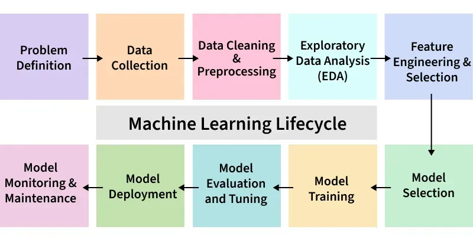

# MLOps Introduction: Final Project Description

## Overview
The final project for the "Introduction to MLOps" course consists of comprehensive tasks covering Machine Learning model development and serving.

Expected results:
- Required: your Github repository containing your code, reports, datasets, etc.
- Optional: external documents/files.
You can use this project structure/repo to kick off your work. You could even fork it to simplify that process. Feel free to modify that project structure and create/rename folder/files.

### Goals
* **Adhere to the ML Lifecycle:** Use the standard ML lifecycle as a continuous reference for all activities.
* **Software Skills:** Apply essential software development knowledge (version control, modularity) to the ML lifecycle.
* **ML Engineering skills:** Implement ML engineering practices for development, deployment, and serving.
* **MLOps Adoption:** Apply and integrate core MLOps concepts throughout the project.

## Final Work Definition
This final work cover the main stages/phases of the ML lifecycle:

The following sections detail the requirements and steps for the final project:

### A) Problem Definition
* **Define an AI/ML Use Case:** Identify a specific problem that can be solved via ML/AI models.
    * Describe the problem context, constraints, goals, benefits, and expected results.
    * **Optional:** Define high-level success metrics (i.e., what results must be achieved to consider the ML solution a success).
* **Data Acquisition:** Identify, define, describe, and analyze your raw dataset(s).
### B) Project Preparation
- Create a **public GitHub repository** in your account. 
    * Suggested naming: `uni_mds_ciclo3_ml_project`.
    * You could also fork this [repo](https://github.com/UNI-MDS/mlops-final-project)
- Clone your repository locally for development.
- Establish a project structure.
- Work within a dedicated **new branch**.

### C) ML Experimentation
* Recomended folders to be used: `notebooks`, `experiments`
* **Execution:** Conduct experiments via Jupyter Notebooks and/or Python scripts.
* **Data Preparation:** Apply data transformations (if needed) to generate your training dataset.
* **Model Selection:** Choose and train your ML models.
* **Evaluation:** Analyze and evaluate the performance results.
* **Model Selection:** Identify your "champion" (best) model.
* **Optional:** Use **MLflow** to track and register your experiments.
* **Expected Result:** notebooks and/or results (plots, images, docs, metrics, etc) about your experiments and evaluations. You can  also put your results in the `reports` folder.
### D) ML Development Activities
* **Data Preparation:**
    * Save your raw dataset in a structured directory (e.g., `/data/raw/`).
    * Implement transformations in a modular Python script (e.g., `src/data_preparation.py`).
    * *Note: If transformations are not required, provide a justification using graphics or analysis.*
    * Describe the features (variables) of the final training dataset.
    * **Expected Result:** A final training dataset saved in a designated folder (e.g., `/data/training/` or `/data/features/`).
* **Model Training Implementation:**
    * Implement training logic in a Python script (e.g., `src/train.py`).
    * Include **model serialization** (saving the model in `.pkl`, `.joblib`, or other standard formats).
    * **Expected Result:** A serialized trained model saved in a folder (e.g., `/models/<model_name>.pkl`).
* **Model Registry (Optional):**
    * Register your model in a registry, such as **MLflow Model Registry**.

### E) Model Deployment & Serving
* **Model Serving Strategy:** Implement one of the following two approaches:
    1.  **Web/REST API:** Use the **Flask** or **FastAPI** library. (Example filename: `src/serving.py`).
    2.  **MLflow Serving:** Serve the model locally using the `mlflow models serve` command.
* **Model Inference:**
    * Launch your model API from the previous step.
    * **Perform Predictions:** Use a REST client (`curl`, a Python script, `Postman`, etc) to request predictions by passing inputs to your API.
    * Document/register your results in report. You could use the `reports` folder or even use the `README.md` file.
    * **Expected Result:** Successful generation of prediction values (class, label, or numerical output).

### F) Delivery:
* Use the `README.md` file as a initial/centralized point to document/describe your work. You can also create other files and refer them via links.
  * You can also create/send additional files if needed.
  * Try to collect images, tables, reports and other resources to show your results.
* When your work is done in your Git branch you should create a Pull Request (PR) to merge your work into `main` branch.
* In that way, The final project (python code, reports, docs, datasets, etc) should be in the `main` branch.
* The optional items will be considered to gain extra points in the evaluation.
* Use the provided Google form to submit your work (essentially giving your Github repo URL link).
